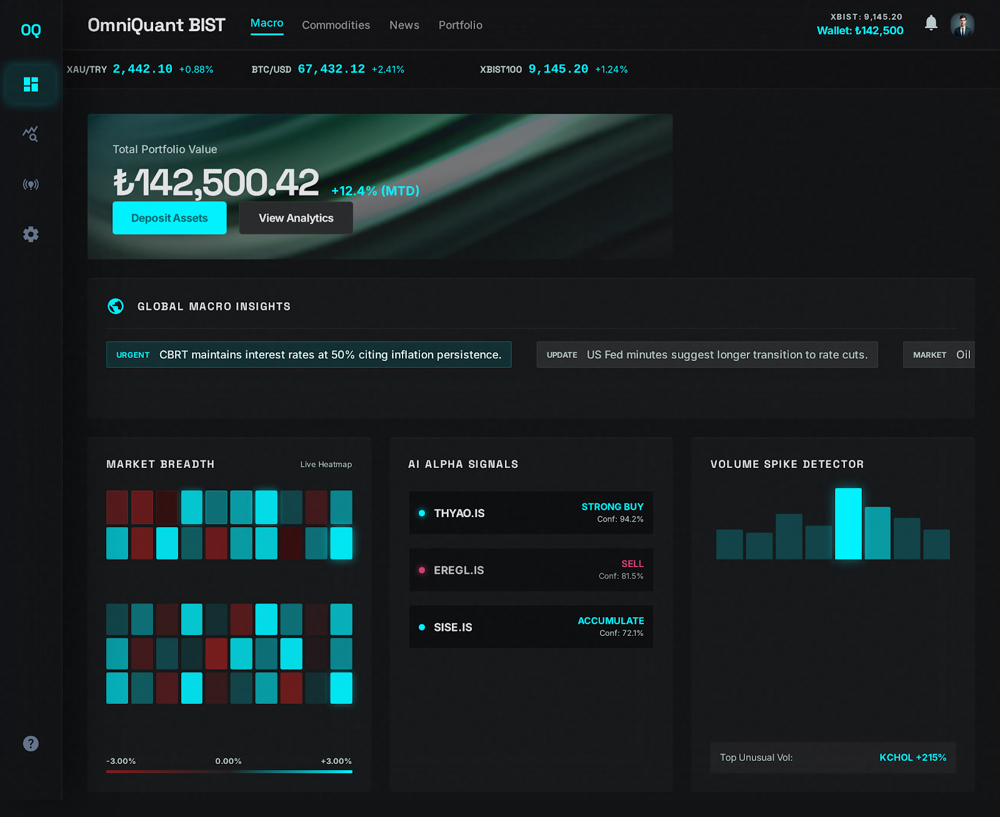
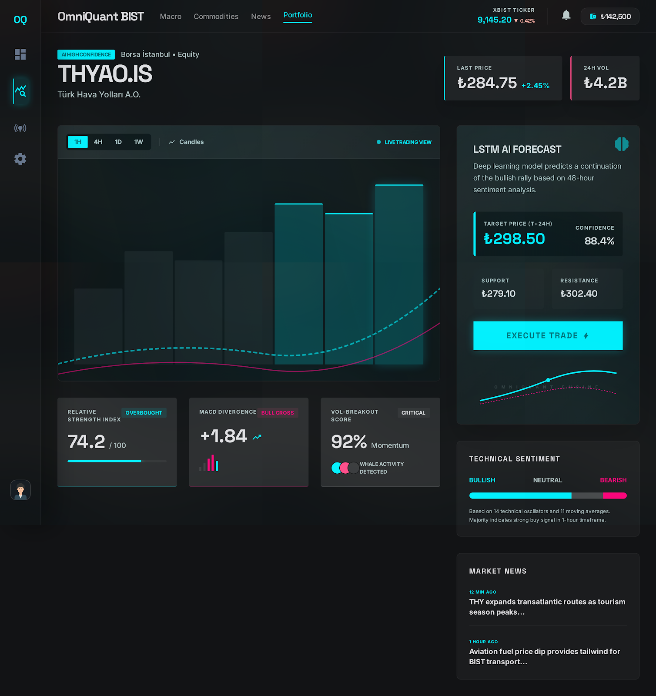
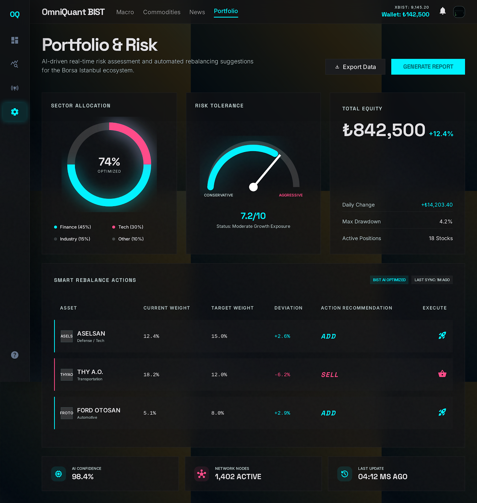
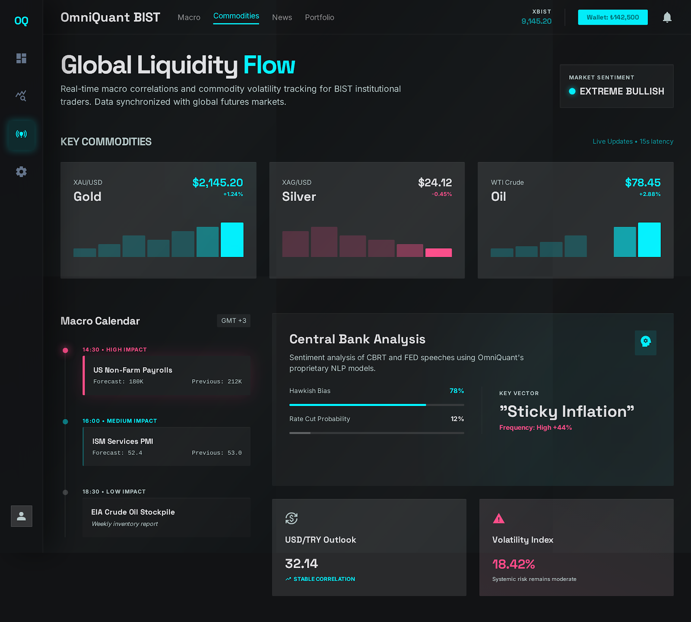
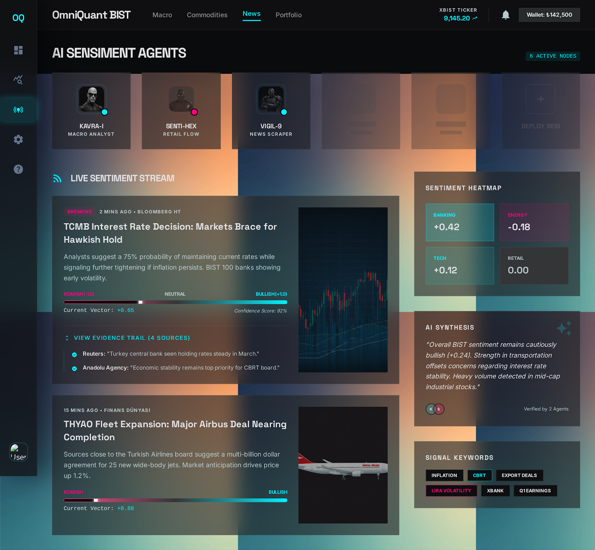

# 🌟 OmniQuant BIST AI

> **Otonom Çoklu-Ajan Borsa Tahmin ve Portföy Yönetim Sistemi (BIST 100)**  
> *Apple Silicon (MPS) hızlandırmalı PyTorch derin öğrenme modelleri, LLM destekli otonom Çoklu-Ajan (CrewAI) orkestrasyonu, MongoDB RAG hafızası ve modern Next.js 14 Dashboard arayüzü ile donatılmış yeni nesil otonom finansal analiz platformu.*

---

[](https://www.python.org/)
[](https://fastapi.tiangolo.com/)
[](https://nextjs.org/)
[](https://pytorch.org/)
[](https://tailwindcss.com/)
[](https://www.mongodb.com/)
[](https://redis.io/)
[](https://www.docker.com/)

---

## 📸 Arayüz Ekran Görüntüleri

### 📊 Modern Analiz Paneli (Dashboard)


### 📈 Hisse Analizi ve PyTorch Yapay Zeka Tahminleri


### ⚖️ Portföy Dağılımı ve Kelly Kriteri Risk Yönetimi


### 🌍 Makroekonomik Takvim ve Endeks Korelasyonları


### 📰 Yapay Zeka Duygu Analizi Merkezi (KAP & RSS Analizi)


---

## 🧠 Sistem Mimarisi

OmniQuant BIST AI, veri madenciliğinden derin öğrenme tahminlerine, haber duygu analizinden ajan bazlı portföy optimizasyonuna kadar tam otonom bir akış sunar:

```mermaid
graph TD
    %% Veri Toplama Aşaması
    subgraph Veri_Boru_Hatti [Veri Boru Hattı]
        A[yfinance Fetcher] -->|Günlük OHLCV| DB[(MongoDB)]
        B[KAP RSS / Scraping] -->|Haberler & KAP Duyuruları| DB
        C[Macro Data Fetcher] -->|Makro Ekonomi & Emtialar| DB
    end

    %% Yapay Zeka Katmanı
    subgraph Yapay_Zeka_Katmani [Yapay Zeka ve Tahmin Modelleri]
        DB -->|Tarihsel Veriler| D[PyTorch LSTM Tahmin Modeli]
        DB -->|Haber Metinleri| E[HuggingFace BERT Turkish Sentiment]
        D -->|MPS Hızlandırmalı Tahminler| F[FastAPI Backend]
        E -->|Duygu Skorları -1 ile 1| F
    end

    %% Çoklu Ajan Orkestrasyonu
    subgraph Ajanlar [CrewAI Çoklu-Ajan Beyni]
        F -->|Analiz İstemi| G[Ana Beyin / Master Agent]
        G --> H[Veri Madenci Ajanı]
        G --> I[Teknik Analist Quant]
        G --> J[Duygu Analisti BERT]
        G --> K[Takas & Korelasyon Ajanı]
        G --> L[Risk & Sermaye Yöneticisi]
        G --> M[Eleştirmen RAG Belleği]
        M <-->|Sürekli Öğrenme| DB
    end

    %% Sunum Katmanı
    Ajanlar -->|Sentezlenmiş Portföy Kararı| F
    F -->|REST / WebSockets| N[Next.js 14 Frontend Dashboard]
    F -->|Celery & Redis| O[Periyodik Arka Plan Görevleri]
    O -->|WhatsApp / Telegram API| P[Yatırımcı Anlık Bildirimleri]
end
```

---

## 🚀 Öne Çıkan Özellikler

1. **Apple Silicon (MPS) Donanım Hızlandırması:** PyTorch zaman serisi LSTM modeli, Apple M-serisi çipler üzerinde **Metal Performance Shaders (MPS)** kullanarak yüksek hızlı lokal eğitim ve tahmin gerçekleştirir.
2. **Çoklu-Ajan Orkestrasyonu (CrewAI & LangChain):** 7 farklı finans ve veri uzmanı yapay zeka ajanı, Ollama (Llama 3.2) yerel LLM beynini kullanarak portföy dağıtımı, stop-loss seviyeleri ve hedef fiyatlar üretir.
3. **RAG & Sürekli Öğrenen Bellek (Vector Search):** Eleştirmen ajanı geçmiş tahminlerin doğruluğunu ölçer, kazanılan dersleri vektörleştirerek MongoDB'de saklar. Master Agent, yeni kararlarda bu RAG belleğinden beslenir.
4. **Hibrit Teknik + Duygu Sentezi:** Teknik göstergeler (RSI, MACD, Bollinger, OBV, Tenkan-sen, Fib %61.8) ile KAP & RSS haberlerinin Türkçe BERT (`dbmdz/bert-base-turkish-cased`) duygu analiz skorları tek bir tahmin matrisinde birleştirilir.
5. **Kelly Kriteri Risk Yönetimi:** Risk Yöneticisi Ajanı, volatilite ve trend gücüne göre Kelly Kriteri algoritmasını işleterek lot sayısını ve sermaye dağılım oranlarını matematiksel olarak optimize eder.
6. **Gerçek Zamanlı İletişim (WebSockets):** BIST seans saatlerinde (Hafta içi 10:00 - 18:00) Next.js dashboard'una canlı fiyat dalgalanmaları (jitter simulation) WebSocket üzerinden aktarılır.
7. **Arka Plan Görev Yöneticisi (Celery & Redis):** Günlük veri çekme, model güncelleme, rebalans kontrolleri ve sabah WhatsApp bülteni gönderimleri Celery Beat ile otomatik yürütülür.

---

## 🛠️ Proje Dizin Yapısı

```bash
OmniBIST/
├── backend/
│   ├── agents/
│   │   └── crew_setup.py          # CrewAI Ajan ve Görev Tanımları (Llama 3.2)
│   ├── data_pipeline/
│   │   ├── yfinance_fetcher.py    # BIST 100 OHLCV fiyat toplama
│   │   ├── indicators.py          # Teknik göstergelerin (RSI, MACD, BB) hesabı
│   │   ├── kap_news.py            # KAP duyuruları & haber scraping
│   │   ├── macro_data.py          # ABD/TR makro faiz, enflasyon ve emtialar
│   │   └── correlation.py         # Endeks korelasyon ve Beta katsayı analizi
│   ├── models/
│   │   ├── time_series.py         # PyTorch LSTM Modeli (MPS GPU destekli)
│   │   ├── sentiment.py           # Türkçe BERT Ekonomi Duygu Analiz Modeli
│   │   └── weights_*.pth          # 100+ BIST hissesinin eğitilmiş ağırlıkları
│   ├── main.py                    # FastAPI Ana Sunucusu, WebSockets & API Uç Noktaları
│   ├── worker.py                  # Celery Arka Plan Görevleri & WhatsApp bülteni
│   ├── train_models.py            # Tüm hisselerin modellerini eğiten betik
│   ├── database.py                # MongoDB vektör & koleksiyon entegrasyonu
│   └── websocket_manager.py       # WebSocket istemci yönetimi
├── frontend/
│   ├── src/
│   │   ├── components/            # Dashboard Widget'ları (Heatmap, Analiz, vb.)
│   │   └── pages/                 # Next.js Sayfaları (Framer Motion & Recharts)
│   ├── Dockerfile
│   └── package.json
├── docker-compose.yml             # MongoDB, Redis, Backend, Worker, Beat, Frontend orkestrasyonu
├── .gitignore                     # Git tarafından takip edilmeyecek dosyalar
└── .env.example                   # Çevre değişkenleri şablonu
```

---

## 📦 Kurulum ve Çalıştırma

Sistemi **Lokal Kurulum** veya **Docker Compose** olmak üzere iki farklı yöntemle ayağa kaldırabilirsiniz.

### Yöntem A: Docker Compose ile Hızlı Başlatma (Tavsiye Edilen)

Tüm mikroservisleri (MongoDB, Redis, FastAPI, Celery, Celery Beat ve Next.js) tek bir komutla orkestre edebilirsiniz.

1. `.env.example` dosyasını kopyalayarak `.env` oluşturun ve ayarlarınızı girin:
   ```bash
   cp .env.example .env
   ```
2. Docker kapsayıcılarını inşa edin ve arka planda çalıştırın:
   ```bash
   docker-compose up --build -d
   ```
3. Tarayıcınızda Next.js Dashboard'unu açın: `http://localhost:3000`

---

### Yöntem B: Lokal Geliştirme Ortamı Kurulumu

#### 1. Veritabanı ve Yerel LLM Önkoşulları
* Bilgisayarınızda **MongoDB** (`mongodb://localhost:27017`) ve **Redis** (`redis://localhost:6380`) servislerinin çalıştığından emin olun.
* **Ollama**'yı indirip kurun ve 2GB RAM tüketimiyle Apple Silicon üzerinde son derece verimli çalışan `llama3.2` modelini çekin:
  ```bash
  ollama run llama3.2
  ```

#### 2. Backend (FastAPI & PyTorch & Celery) Çalıştırma
1. Backend dizinine geçin ve sanal ortam oluşturup aktif edin:
   ```bash
   cd backend
   python3 -m venv venv
   source venv/bin/activate
   ```
2. Gerekli kütüphaneleri kurun:
   ```bash
   pip install -r requirements.txt
   ```
3. BIST 100 hisse verilerini çekin ve teknik indikatörleri hesaplayın:
   ```bash
   python data_pipeline/yfinance_fetcher.py
   python data_pipeline/indicators.py
   ```
4. Derin Öğrenme LSTM modelini Apple Silicon M1/M2/M3 GPU (`mps`) hızlandırmasıyla eğitin:
   ```bash
   python train_models.py
   ```
5. FastAPI Uvicorn sunucusunu başlatın:
   ```bash
   uvicorn main:app --reload --port 8000
   ```
6. (İsteğe bağlı) Celery işçisini ve zamanlayıcıyı çalıştırın:
   ```bash
   # Yeni bir terminalde sanal ortamı açarak:
   celery -A worker worker --loglevel=info
   
   # Celery Beat zamanlayıcısı için:
   celery -A worker beat --loglevel=info
   ```

#### 3. Frontend (Next.js 14) Çalıştırma
1. Frontend dizinine geçin ve bağımlılıkları yükleyin:
   ```bash
   cd frontend
   npm install
   ```
2. Geliştirme sunucusunu başlatın:
   ```bash
   npm run dev
   ```
3. Arayüze `http://localhost:3000` adresi üzerinden erişin!

---

## 📈 Ajan Rolleri & Detayları

* **Veri Madencisi (Data Gatherer):** Günlük hisse kapanış fiyatlarını, makro verileri, emtiaları ve en güncel KAP haberlerini toplayıp JSON yapısına büründürür.
* **Teknik Analist (Quant Analyst):** PyTorch LSTM tahmin modelini ve RSI, MACD gibi teknik göstergeleri değerlendirerek salt teknik AL/SAT sinyalleri oluşturur.
* **Duygu Analisti (Sentiment Analyst):** Türkçe BERT modeliyle son 5 şirket haberinin başlığını analiz eder, duygu skoru üreterek piyasa psikolojisini ölçer.
* **Takas & Korelasyon Ajanı:** Endeks içi sektör geçişlerini ve hissenin XU100 endeksi ile korelasyon gücünü (Beta katsayısını) hesaplar.
* **Risk ve Sermaye Yöneticisi:** Volatilitelere bağlı olarak Kelly Kriterini çalıştırır; Lot sayısı, Stop-Loss ve Take-Profit (Kâr Al) limitlerini belirler.
* **Eleştirmen (RAG / Memory):** Geçmiş tahminlerin ne kadar doğru çıktığını test ederek dersler çıkarır. Çıkan dersleri MongoDB'de vektörleştirerek hafızaya alır.
* **Ana Beyin (Master Agent):** RAG hafızasındaki dersleri, analist ajanların raporlarını ve risk kısıtlarını bir araya getirerek nihai portföy dağıtım kararını verir.

---

## 📞 WhatsApp Bülten & Anlık Bildirimler
Sistem, `worker.py` içerisindeki Celery görevleri vasıtasıyla her sabah seans açılmadan önce WhatsApp API üzerinden yatırımcıya **Morning Brief (Sabah Bülteni)** iletir. Bu bültende:
- Günlük piyasa duyarlılığı tahmini
- En yüksek potansiyelli 3 BIST 100 hissesi
- Teknik ve makro analizlerin 3 cümlelik lüks yapay zeka özeti yer alır.

---

## 🛡️ Lisans
Bu proje Apache 2.0 Lisansı ile lisanslanmıştır. Detaylar için `LICENSE` dosyasına göz atabilirsiniz.
